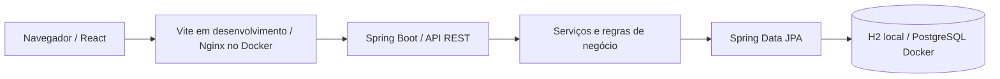

<div align="center">

# DevFlow Platform

**Organização de projetos e tarefas para equipes de tecnologia.**

Java 21 · Spring Boot 3 · React · TypeScript · PostgreSQL

[](https://github.com/juceliocoelho2022/devflow-platform/actions/workflows/ci.yml)

[Executar localmente](#executar-localmente) · [Arquitetura](#arquitetura) · [Roadmap](#roadmap) · [Contribuir](CONTRIBUTING.md)

</div>

## Sobre o projeto

DevFlow é um MVP full-stack de gestão de projetos com dashboard, cadastro de projetos e quadro Kanban. O objetivo é demonstrar a integração entre uma API Java e uma interface React, com autenticação JWT, persistência relacional e execução em containers.

A interface usa português e mantém uma identidade visual em azul-marinho e azul elétrico. O código utiliza nomes técnicos em inglês. O MVP é **single-tenant** e contém dados de demonstração; ainda não está preparado para operação em produção.

## Funcionalidades

- Login com JWT e senhas armazenadas com BCrypt.
- Cadastro e listagem de projetos e tarefas.
- Kanban com cinco etapas, movimentação por arrastar e soltar ou botões.
- Busca de tarefas e filtros por projeto e prioridade.
- Distribuição de tarefas por status e progresso por projeto calculados a partir das tarefas.
- Mensagens de validação da API e preservação da sessão em falhas de conexão.
- API com DTOs, camada de serviços e documentação OpenAPI.
- Ambiente Docker Compose com PostgreSQL, API e frontend servido por Nginx.

### Estado atual

| Área | Situação |
| --- | --- |
| Projetos e tarefas | Cadastro, listagem e movimentação implementados |
| Dashboard | Contagens conectadas à API; produtividade e atividades são demonstrativas |
| Equipes, usuários, relatórios e configurações | Navegação e telas de preparação, sem fluxos completos |
| Papéis ADMIN, MANAGER e MEMBER | Criação restrita a ADMIN/MANAGER; consulta e movimentação para os três papéis |
| Testes | Métricas e API no frontend; integração de autenticação/permissões e configuração de produção no backend |

## Executar localmente

### Opção 1 — Docker Compose

Requisito: Docker com Compose disponível.

```bash
git clone https://github.com/juceliocoelho2022/devflow-platform.git
cd devflow-platform
```

Copie `.env.example` para `.env` e execute:

```bash
docker compose up --build
```

| Serviço | Endereço |
| --- | --- |
| Aplicação | http://localhost:3000 |
| API | http://localhost:8080/api |
| Swagger UI | http://localhost:8080/swagger-ui.html |

O PostgreSQL mantém os dados no volume `postgres_data`. Para parar a stack sem apagar os dados, use `docker compose down`.

### Opção 2 — Java e Node.js

Requisitos: Java 21, Maven 3.9+ e Node.js 22.12+ com npm.

Em um terminal, inicie a API:

```bash
cd backend
mvn spring-boot:run
```

Em outro terminal, inicie o frontend:

```bash
cd frontend
npm ci
npm run dev
```

Abra http://localhost:5173. O Vite encaminha `/api` para `http://localhost:8080`.

O perfil padrão utiliza H2 em memória: os dados são recriados a cada inicialização. O arquivo `.env` da raiz é lido pelo Docker Compose; o Spring Boot executado diretamente usa variáveis do ambiente. Para alterar a URL da API no Vite, configure `VITE_API_URL` em `frontend/.env.local`.

### Acesso de demonstração

| Campo | Valor |
| --- | --- |
| E-mail | `admin@devflow.com` |
| Senha | `admin123` |

O inicializador cria contas demonstrativas apenas no perfil `dev` (incluído no Compose local como `dev,docker`). O login não preenche credenciais automaticamente. Em produção, use o perfil `prod` e um banco separado, conforme o [guia de produção](docs/production.md); não publique o Compose local.

## Arquitetura



```text
backend/       API Java: controllers, services, repositories, DTOs e segurança
frontend/      SPA React, estilos e testes
.github/       Integração contínua e modelos de colaboração
docs/          Especificação e guia de publicação
portfolio/     Site pessoal estático, independente da aplicação
```

A pasta `DevFlow-Enterprise-Professional/` preserva a estrutura inicial do repositório. A aplicação e os comandos deste README utilizam `backend/` e `frontend/` na raiz.

O backend usa Flyway no perfil Docker e Hibernate para criar o esquema H2 local. DTOs separam os contratos HTTP das entidades JPA. A autenticação é stateless; o frontend guarda o token no armazenamento local do navegador.

## Produção

Consulte o [guia de produção](docs/production.md) para configurar JWT, CORS, PostgreSQL e o primeiro administrador. O arquivo `docker-compose.production.yml` separa o ambiente público da demonstração local e requer um proxy HTTPS. O deploy ainda não foi realizado.

## API

As rotas protegidas exigem `Authorization: Bearer <token>`. Explore os contratos completos pelo Swagger com a API em execução.

| Método | Rota | Finalidade |
| --- | --- | --- |
| POST | `/api/auth/login` | Autenticar |
| GET | `/api/dashboard` | Consultar indicadores |
| GET / POST | `/api/projects` | Listar / criar projetos |
| GET / POST | `/api/tasks` | Listar / criar tarefas |
| PATCH | `/api/tasks/{id}/status` | Mover tarefa |

## Qualidade e validação

Frontend, na pasta `frontend`:

```bash
npm ci
npm test
npm run build
```

Backend, na pasta `backend`:

```bash
mvn -B verify
```

O workflow [CI](.github/workflows/ci.yml) executa testes e build do frontend e `mvn verify` no backend em pushes e pull requests. O badge reflete os resultados após a publicação e execução do workflow; não representa cobertura de testes.

## Roadmap

- [x] Cadastro de projetos e tarefas, Kanban, busca e filtros.
- [x] Indicadores de status e progresso por projeto baseados em tarefas.
- [x] Tratamento de falhas da API no frontend.
- [x] Aplicar e testar autorização por papel nas operações.
- [x] Restringir o carregamento de dados demonstrativos ao ambiente de desenvolvimento.
- [ ] Implementar séries históricas de produtividade e registro real de atividades.
- [ ] Ampliar testes de integração e testes dos fluxos no navegador.
- [ ] Implementar os fluxos de equipes e usuários.

Consulte a [especificação do produto](docs/project-spec.md) para as decisões e os limites do MVP.

## Contribuição e licença

Sugestões e correções são bem-vindas. Leia o [guia de contribuição](CONTRIBUTING.md) e use os modelos de issues e pull requests.

O projeto ainda não possui uma licença de distribuição definida. A publicação do código não concede automaticamente permissão de reutilização.

Desenvolvido por [Jucelio Coelho](https://github.com/juceliocoelho2022).
